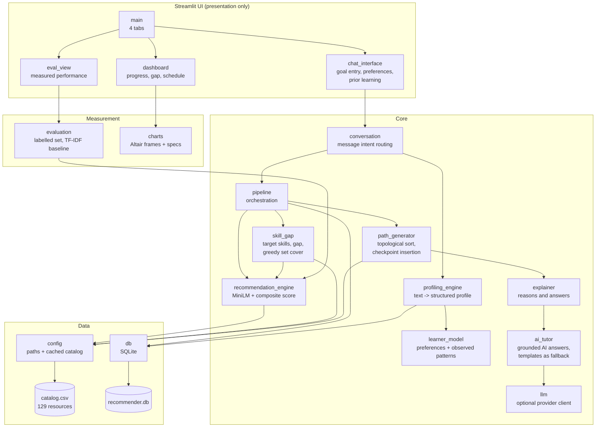

# Solution Documentation

AI-Powered Personalized Learning Path Recommender.

The specification this implements is [`BRIEF.md`](BRIEF.md). Setup and run
instructions are in [`README.md`](README.md). This document covers the design: how
the problem is modelled, what each algorithm does, why the constants are what they
are, what was measured, and what is still wrong with it.

---

## 1. How the problem is framed

The obvious reading of "recommend courses for a goal" is a retrieval problem: embed
the goal, embed the catalog, return the nearest neighbours. That is what the first
version of this project did, and it is not sufficient.

Retrieval answers *"what resembles this goal?"*. The brief asks for something
harder — it names **skill-gap identification** as a core mechanism and asks for a
*sequence* of resources that gets a specific learner from where they are to where
they want to be. Those need a representation of the destination, which similarity
ranking does not have.

Concretely, similarity-only ranking fails in ways we observed:

| Failure | Cause | Example |
|---|---|---|
| Off-topic padding | `top_n` is filled regardless of quality | Cloud-computing courses at 0.43 similarity in a data-analyst path |
| No notion of "done" | Nothing represents the target skill set | Path ends when candidates run out, not when the goal is met |
| No credit for prior knowledge | Held skills never enter the ranking | A five-year Python developer is offered introductory Python |
| Confident nonsense | Ranking always returns a top result | A request about medieval manuscripts returns five courses with match percentages |

So the system is modelled as **four stages**, not one:

```
    what does this goal require, and what is missing?   -> gap analysis
    what is the smallest set of courses that closes it? -> coverage selection
    in what order, respecting dependencies?             -> sequencing
    what has this learner already done or reacted to?   -> persistence + adaptation
```

The stated objective is: **cover the learner's skill gap in the fewest study hours,
subject to prerequisite validity and the learner's stated pace.** Everything below
serves that sentence, and it is what makes the design arguable rather than a
collection of heuristics.

---

## 2. Architecture



Two structural rules hold throughout:

**The UI computes nothing.** `chat_interface`, `dashboard` and `eval_view` render
values produced elsewhere. `charts` deliberately splits frame-building (pure pandas,
testable) from chart specs, so the data behind every visual is assertable without
Streamlit.

**One orchestration path.** `pipeline.build_learning_path()` is the only place the
flow is expressed. `chat_interface` and `dashboard` previously held line-for-line
copies, and that duplication is precisely how a missing progress-row write survived
in one of them while being fixed in the other.

---

## 3. Data model

### Catalog — `data/catalog.csv`, 129 resources

One table with a type discriminator rather than three files, so a single embedding
index and a single prerequisite graph serve all three types. That is what lets the
sequencer interleave them under identical rules.

| Column | Notes |
|---|---|
| `course_id` | Primary key. Prefix encodes type: `DS/WD/UX/BM/CD` course, `PR` project, `AS` assessment |
| `title`, `description` | Embedded together with `skills` |
| `skills` | Comma-separated. Meaning depends on type: a course **teaches** these, a project **exercises** them, an assessment **validates** them |
| `prerequisites` | Comma-separated `course_id`s |
| `difficulty_level` | `beginner` / `intermediate` / `advanced` |
| `category` | One of five domains |
| `resource_type` | `course` / `project` / `assessment` — authoritative |
| `duration_hours` | Drives the schedule and the per-hour selection objective |

| Type | Count | Role | Gated? |
|---|---|---|---|
| `course` | 84 | Teaches skills; the only type that can close a gap | 69 of 84 |
| `project` | 25 | Applies skills taught earlier | always |
| `assessment` | 20 | Validates a skill cluster, 1-2h | always |

42 beginner / 57 intermediate / 30 advanced; 1,858 hours total; 377 distinct skill
tokens. `generate_catalog.py` validates before writing: no duplicate IDs, no
dangling prerequisite references, every resource has skills and a positive
duration, and every project and assessment is gated behind at least one
prerequisite.

**`course_id` is a misnomer now that it addresses projects and assessments.**
Renaming it would ripple through `progress.course_id` and `feedback.course_id` in
SQLite plus every module, for no functional gain. Recorded here as a known wart
rather than quietly left to confuse a reader.

### Persistence — SQLite

| Table | Purpose |
|---|---|
| `users` | One row per session |
| `profiles` | Goal, skills, level, interests, `target_skills`, `preferences` (JSON) |
| `progress` | Per-resource status, `step_number`, and `source` (`in_app` / `declared`) |
| `feedback` | `too_easy` / `not_interested` events |

Two decisions worth stating:

**Prior learning is stored as `progress` rows**, with `status='completed'` and
`source='declared'`, rather than in a parallel table. Exclusion from
recommendations, skill crediting in gap analysis, and prerequisite satisfaction
then all work with no new plumbing. `source` exists so editing the declared list
never touches progress genuinely earned in the app.

**`preferences` is a JSON blob** on `profiles`, written by `set_preferences()`
independently of `upsert_profile()`. Re-describing a goal should not reset the fact
that you have six hours a week — and one column per preference would mean a
migration each time one is added.

Schema changes are applied by `db._migrate()`, which adds columns to existing
databases rather than requiring a wipe.

---

## 4. Algorithms

Notation: **N** = catalog size (129), **T** = target skills (≤ 24), **C** = candidate
pool (30), **d** = embedding dimension (384).

### 4.1 Profiling — text to structured profile

Three stages in `profiling_engine`, plus prior-learning detection.

**Clause-level skill extraction with polarity.** Text is split into clauses, each
clause is tagged as describing something the learner *has* or *wants*, and catalog
skills are matched within each clause. A clause with no cue inherits the previous
clause's polarity, so "I know Python, SQL and Excel" attributes all three.

This exists because flat substring matching over the whole sentence cannot tell the
two apart: "I'm a complete beginner and want to learn web development with React"
previously yielded `current_skills: ['react']`, and the explainer then told a
self-declared beginner that a course built on their React experience.

Cue-less clauses before any cue default to *wanted*. Claiming a skill the learner
never mentioned is the more damaging error, because it feeds explanations that
flatter them with experience they lack.

**Experience-level inference** is a priority ladder: an explicit self-declaration
("complete beginner", "no experience") wins outright, then an extracted years
figure (≥ 4 advanced, 1-3 intermediate), then seniority keywords, then weaker
hints, then a beginner default. The years patterns match in both directions and
tolerate intervening words — an earlier version required "years of experience" to be
adjacent, so "5 years of Python experience" failed to match and a senior developer
was handed a beginner path.

**Domain classification** embeds the goal and compares it against embeddings of the
five category labels, keeping only categories scoring within `INTEREST_RATIO` of the
best. Without the cutoff it returned a fixed top-3, so a purely analytical goal
listed "Web Development" as an interest and the explainer cited it as something the
learner cared about.

Complexity: O(clauses × vocabulary) regex matching plus one embedding call.

### 4.2 Gap analysis — `skill_gap`

There is no ground-truth "skills required to be a data analyst" table, so the
target set is inferred from the catalog:

1. Skills the learner explicitly named are taken at face value with relevance
   `EXPLICIT_RELEVANCE`, above any inferred skill.
2. The goal is matched against **courses only** — a project exercises skills and an
   assessment checks them, so neither can define what a goal requires. Every skill
   taught by a strongly matching course becomes a candidate, with relevance equal to
   the similarity of the *best course teaching it*. Tracing relevance to one course
   keeps it explainable: "SQL is a target because *SQL for Data Analysts* matches
   your goal at 0.79".
3. Candidates are kept above `RELEVANCE_RATIO` × anchor, then capped at
   `MAX_TARGET_SKILLS`.

The gap is the target set minus what the learner holds, where "holds" includes both
stated skills and skills acquired from completed resources.

**Skill equivalence is deliberately conservative** — normalised exact match, or the
same token set in a different order. An earlier version used token-*subset*
matching so "sql" covered "sql joins", which is defensible; but the rule cannot
distinguish that from "sql" covering "sql injection", which is a different topic
with identical token structure. Given a choice between occasionally over-teaching
and occasionally telling a learner they already know something they do not,
over-teaching is the safer error.

Complexity: one embedding call plus O(N·d) scoring, then O(T) set operations.

### 4.3 Coverage selection — greedy weighted set cover

Selection replaces "take the top N by similarity". At each step it picks the course
maximising

```
    (relevance-weighted newly-covered gap skills / duration_hours) x (0.5 + 0.5 x similarity)
```

removes the skills it covers, and repeats until the gap is closed, `coverage_target`
is reached, or `max_items` is hit.

Set cover is NP-hard; greedy is the standard approximation and is within a
`ln(n)+1` factor of optimal. That is more than adequate here, and it is fast and
explainable — both of which matter more than optimality for a path a human has to
read and trust.

Dividing by duration makes the objective **"close the most gap per hour"**, which is
what "the right sequence to reach a goal" actually asks for. The relevance factor
breaks ties toward better-matching courses.

Two consequences worth noting:

- **Off-topic resources are excluded structurally, not by threshold.** A course
  covering no remaining gap skill is never selected, at any similarity. This is what
  removed the cloud-computing padding from data-analyst paths.
- **Only courses are selected.** Assessments are 1-2 hours, so under a per-hour
  objective they would look like the most efficient way to learn anything, while
  teaching nothing. They are woven in by the sequencer instead.

Complexity: O(max_items × C × T).

### 4.4 Sequencing — `path_generator`

**Topological sort** (Kahn's algorithm) over the prerequisite graph. Rather than a
FIFO frontier, the set of currently-available resources is re-sorted each iteration
by `(difficulty, -score)`, so the easiest best-matching available resource is chosen
next instead of an arbitrary valid one. A cycle in the data leaves nodes with
non-zero in-degree; those are appended in difficulty order rather than dropped, so
malformed data degrades the ordering instead of losing resources.

**Bounded prerequisite expansion.** Missing prerequisites are pulled in, but only
`MAX_PREREQUISITE_DEPTH` levels deep, and groundwork below the learner's level is
skipped. Unbounded expansion made advanced goals unusable: five recommended courses
became a twenty-course path opening with absolute basics.

**Held skills discharge prerequisites.** Prerequisites are resource IDs, so nothing
but `DS001` can satisfy a dependency on `DS001`. A resource whose skills are *all*
held is therefore dropped. The test is strict — every skill must be held — so partial
overlap does not skip real groundwork.

**Checkpoint insertion.** Every `MILESTONE_EVERY` resources, the sequencer inserts
a real assessment and project whose prerequisites are *all* already scheduled. That
condition is what preserves topological validity by construction rather than by
re-sorting afterwards. Among qualifying candidates, the one sharing the most skills
with what has been taught wins, keeping the checkpoint about the work just
completed.

Milestones were previously five fixed strings inserted by position, referring to
project work that did not exist as anything a learner could open. Those strings
remain only as a fallback when the catalog offers nothing unlockable.

Complexity: O(V + E) for the sort, O(N) per checkpoint for candidate selection.

### 4.5 Scoring — `recommendation_engine`

Model: `all-MiniLM-L6-v2`. 384 dimensions, CPU inference, trained with a
cosine objective, fully local. The catalog is embedded once at startup into an
(N × 384) L2-normalised matrix, so ranking is a single matrix multiply and no
per-request model call touches the catalog side.

The reported match is a **bounded composite**, not raw cosine:

```
    score = (1 - LEVEL_WEIGHT) x clamp(cosine, 0, 1) + LEVEL_WEIGHT x level_fit
```

Both terms lie in [0, 1], so the composite does too — *by construction*, not by
clamping afterwards. This replaced multiplying cosine by 1.15 for accessible
courses, which pushed scores above 1.0 and rendered as a "115% match", and which
has no principled interpretation. Each component is returned alongside the
composite so the UI can decompose a score into "how well it matches" versus "how
well it fits your level".

### 4.6 Adaptation

| Signal | Effect |
|---|---|
| Resource completed | Its skills count as held → gap shrinks → remainder re-selected |
| `too_easy` ×2 | Effective level promoted one tier, capped at advanced |
| `not_interested` | Resource excluded; level untouched |
| Prior learning declared | Excluded, skills credited, prerequisites satisfied |
| Preferences changed | Reinforcement order, hour budget and schedule change |

The two feedback buttons previously behaved identically, because only the union of
feedback resource IDs was ever read back. They are distinguished now, which is the
difference between feedback and a second delete button.

### 4.6b Optional AI answers — `llm`, `ai_tutor`

The template Q&A handles seven question shapes and nothing else. An LLM covers the
rest when a key is configured.

**Where the boundary sits, and why.** The model never selects a resource. Selection
happens in `skill_gap` by greedy set cover over real catalog rows with real
prerequisites. The model receives a facts block — the resource's description,
skills, prerequisites resolved to titles, duration, which of the learner's gap
skills it closes, the learner's goal, level, held skills and preferences, and the
full ordered path — and is instructed to answer only from it.

This is the distinction that makes it defensible. An LLM asked to *generate a
learning path* produces plausible course names that may not exist, with no IDs, no
durations and no prerequisites — which would also break progress tracking, the
schedule and the gap calculation, since all three key off catalog rows. An LLM
asked to *explain a resource it was handed* has nothing to fabricate. So the LLM
sits strictly downstream of every decision, never inside one.

**Three properties hold by construction:**

- *Optional.* With no key, `is_configured()` is false and behaviour is identical to
  before. The local-only property is preserved for anyone who does not opt in.
- *Cannot break.* `llm.complete()` returns `(text, error)` instead of raising. No
  key, dead network, rate limit, expired key or wrong model name all fall back to
  templates. Asserted in both self-tests against a dead endpoint.
- *Attributable.* `Answer.source` records which engine replied and the UI shows it,
  so a generated answer is never presented as a computed one.

Keys come from `.streamlit/secrets.toml` or the environment, never from source.
`LLMConfig.describe()` and `redacted_key` exist so config can be displayed safely,
and `_scrub()` strips the key from error strings — necessary because Gemini passes
it as a query parameter, so it would otherwise appear in a connection error.

One adapter covers OpenAI-compatible `/chat/completions` (OpenAI, Groq, OpenRouter,
Together, DeepSeek, and local Ollama or LM Studio via `LPR_LLM_BASE_URL`); a second
covers Gemini's differently-shaped `generateContent`. Answers are cached on
question plus learner state, because Streamlit re-runs the script on every
interaction and an uncached call would re-bill and re-wait on each one.

### 4.7 Conversation — `conversation`

Messages are classified into one of seven intents before anything is applied:
`reset`, `question`, `mark_completed`, `resize`, `set_preferences`, `add_skills`,
`new_goal`. Only a genuinely new objective rebuilds the profile.

**Order of testing is load-bearing.** "I also want to learn Docker" contains "want
to learn", which alone reads as a new goal, so the additive cue must be tested
first. A question must be recognised before its content words are mined for skills,
or "what if I already know Python?" registers Python as a new skill.

Classification is rule-based on purpose. These are short, formulaic utterances
whose signal is a literal word — "also", "shorter" — which is exactly where patterns
beat embeddings. Embeddings are used where meaning is genuinely fuzzy, in matching
goals to resources. Using the model here would add latency and unpredictability for
no accuracy gain.

---

## 5. Calibrated constants

Every non-obvious number, what it does, and why it holds that value.

| Constant | Value | Rationale |
|---|---|---|
| `LEVEL_WEIGHT` | 0.25 | Started at 0.15; a five-year developer searching for MLOps still had "Introduction to Cloud Computing" ranked first, because a strong semantic match swamped the level term |
| `_LEVEL_FIT` | `{0: 1.0, -1: 0.6, -2: 0.2, +1: 0.55, +2: 0.2}` | One tier below retains revision value; two below is mostly redundant; one above is a reasonable stretch |
| `RELEVANCE_RATIO` | 0.72 | Relative rather than absolute, because a narrow goal scores higher across the board than a vague one |
| `RELEVANCE_ANCHOR_K` | 5 | Anchor averages the top 5 **course** similarities. Anchoring on the single best match meant naming a course ("I already finished SQL for Data Analysts") made it score ~0.99 and filtered everything else out, collapsing a data-analyst goal from 19 targets to 5. Averaging over *skills* does not fix it — one 5-skill course fills the entire top-5 at identical relevance |
| `MAX_TARGET_SKILLS` | 24 | The relative cutoff alone goes slack when scores are flat: an MLOps goal produced 80 target skills, which is a curriculum, not a gap |
| `MIN_GOAL_CONFIDENCE` | 0.38 | Midpoint of the empty band between 33 served goals (0.43-0.87) and 7 unserved (0.12-0.33). An earlier 0.42 left only 0.01 of margin above the worst real goal; `evaluation.py` now asserts ≥ 0.03 on both sides |
| `MAX_PREREQUISITE_DEPTH` | 2 | Unbounded expansion turned 5 recommended courses into a 20-course path for advanced goals |
| `MILESTONE_EVERY` | 3 | Enough material to make a project meaningful without checkpoints dominating |
| `PACE_HOUR_BUDGET` | 160 / 90 / 50 | A relaxed learner handed a 200-hour plan has been given a list, not a path |
| `GAP_CLOSED_FALLBACK_N` | 3 | The already-closed-gap branch previously returned raw similarity order with no filter, quietly reintroducing the padding coverage selection prevents |
| `INTEREST_RATIO` | 0.72 | Below this, a focused goal picked up unrelated domains as "interests" |

---

## 6. What was measured

`app/evaluation.py`, surfaced live in the **How It Performs** tab. 33 labelled
goals across all five domains, plus 7 goals the catalog cannot serve.

### Retrieval: does the embedding model earn its place?

The baseline is TF-IDF over exactly the same assembled text, with the difficulty
blend switched off on both sides so the comparison isolates text matching.

| Ranker | P@1 | P@3 | P@5 | MRR | Must-have recall@10 |
|---|---|---|---|---|---|
| MiniLM embeddings | **1.00** | **0.90** | **0.82** | **1.00** | **1.00** |
| TF-IDF (lexical) | 0.94 | 0.85 | 0.69 | 0.96 | 0.94 |

Embeddings win by +6% on required-resource recall and +0.13 on P@5. **The margin is
modest, and that is worth stating plainly:** this catalog phrases its titles and
descriptions much as learners phrase goals, which is exactly where lexical matching
competes well. The advantage would widen on a catalog whose wording diverges from
how learners describe what they want.

Ground truth is deliberately two-level. *Category relevance* is computed
automatically and cannot drift, but it is generous — five unhelpful in-domain
courses still score P@5 = 1.00. *Must-have recall* is hand-labelled and stricter,
and it is what would catch a ranker that is directionally right but specifically
wrong.

### Servability gate: does it know what it cannot do?

| | Result |
|---|---|
| Real goals accepted | 33 / 33 |
| Impossible goals rejected | 7 / 7 |
| Real goals score | 0.43 worst, 0.62 mean |
| Impossible goals peak at | 0.33 |
| Threshold margins | +0.048 below worst real, +0.052 above best impossible |

### End-to-end path quality

Five goals, one per domain, run through the whole pipeline.

| | Result |
|---|---|
| Mean gap closed | 90% |
| Mean path length | 8.0 resources, 61 hours |
| Prerequisite-valid | 5 / 5 |
| Contained more than one resource type | 5 / 5 |

---

## 7. Requirement traceability

Every requirement in `BRIEF.md`, the module implementing it, and the test that
verifies it. All tests run with `python -m <module>` and exit non-zero on failure.

### "What to build"

| # | Requirement | Implementation | Verified by |
|---|---|---|---|
| 1 | Conversational interface, natural language | `chat_interface`, `conversation` | `app.conversation` — 18 intent-routing cases; refinement preserves the goal |
| 2 | Profiling: interests, experience level, completed courses, objectives | `profiling_engine` | `app.profiling_engine` — 11 experience cases, 8 polarity cases, 7 prior-learning cases |
| 3 | Recommends courses, projects and learning resources | `recommendation_engine`, `skill_gap`, catalog | `app.config` asserts all three types present; `app.evaluation` asserts paths mix types |
| 4 | Path generator with prerequisites and milestones | `path_generator` | `app.path_generator` — topological validity, contiguous steps, checkpoint insertion, cycle handling |
| 5 | Assistant explains recommendations and answers queries | `explainer`, `ai_tutor`, `llm`, `conversation` | `app.explainer` — 8 intent routes; `app.ai_tutor` — facts grounding and template fallback; `app.llm` — key redaction, graceful failure |
| 6 | Dashboard: progress, skill development, milestones, next actions | `dashboard`, `charts` | `app.charts` — frame correctness incl. no double-counted skills |

### Mechanisms named in the Background and Task prose

| Requirement | Implementation | Verified by |
|---|---|---|
| Identify skill gaps | `skill_gap.compute_gap` | `app.skill_gap` — held skills never appear as gaps; progress shrinks the gap |
| Roadmap of courses, projects **and assessments** | `generate_catalog`, `path_generator` | `app.config`; `app.path_generator` checkpoint assertions |
| Previous learning history | `db.set_prior_learning`, `profiling_engine.extract_completed_resources` | `app.db` — editing declared learning never erases in-app progress |
| Adapt on feedback **and progress** | `pipeline.acquired_skills`, `resolve_experience_level` | `app.pipeline` — completing work shrinks the gap; `too_easy` promotes, `not_interested` does not |
| Learning patterns | `learner_model.derive_patterns` | `app.learner_model` — favoured/avoided types, completion rate |
| Learning preferences | `learner_model.LearnerPreferences` | `app.learner_model`; `app.pipeline` — preferences change path length and ordering |

### Judged criteria

| Criterion | Where it is demonstrated |
|---|---|
| Problem Understanding & Design | This document; `BRIEF.md`; the four-stage model in §1 |
| Functionality & Completeness | Traceability tables above; 12 self-tested modules |
| AI/ML Implementation | §4.2-4.5; **How It Performs** tab; `app/evaluation.py` |
| Innovation & Creativity | Gap-coverage set cover over similarity ranking; skill-based prerequisite discharge; servability gate; stated-versus-observed learner model |
| UX & Interface | 4 tabs; gap and schedule visualisations; type-aware explanations; honest no-match state |
| Performance & Code Quality | Embed-once caching; single matmul ranking; `lru_cache` catalog; 12 assertion-based self-tests; pinned dependencies |

---

## 8. Limitations

Stated plainly, because a prototype that claims none is not being honest.

**The catalog is synthetic.** 129 generated resources with clean, complete
prerequisite data and consistent skill labels. Real catalogs have gaps, duplicates
and inconsistent vocabulary, all of which would degrade the measured figures.

**The evaluation set is ours.** 33 goals written alongside the catalog they test.
Real learners phrase things nobody anticipated, and no offline set captures that.

**Nothing measures learning.** Whether a path actually gets someone to their goal
requires longitudinal data on real learners. Every metric here is about retrieval
and structural quality, not outcomes.

**Prerequisites are resource IDs, not skills.** Skill-based discharge (§4.4) works
around the symptom, but the underlying model cannot express "this dependency is
satisfied by equivalent knowledge from elsewhere". Skill-level prerequisites would
be the correct fix and would remove the workaround.

**`load_teachable_skills()` is currently non-binding.** It exists so gap analysis
only targets skills something actually teaches. In this catalog every skill on a
project or assessment also appears on a course, so it equals the full vocabulary
(377 = 377). It is defensive against a catalog where that is not true.

**Skill equivalence is strict.** By choosing normalised exact match over token
subsets (§4.2), gaps err slightly wide — a learner who knows "sql" is still taught
"sql joins". The alternative risked telling learners they already know things they
do not.

**Target skills are inferred, not authoritative.** They come from the catalog's own
skill labels via semantic matching. A genuine skills taxonomy for each role would be
better and is what a production version should use.

**Single-user, no authentication.** Sessions are UUIDs in the URL query string.
Anyone with the link resumes that session. Fine for a local prototype, not for
deployment.

**AI answers are grounded but not verified.** The facts block constrains the model
and the prompt forbids invention, but neither is a guarantee — grounding reduces
hallucination, it does not eliminate it. Nothing programmatically checks that an
answer follows from the facts. The mitigations are that the model cannot influence
any recommendation, and that the UI labels which engine answered. A production
version should validate answers against the facts, or restrict AI answers to
questions the templates cannot handle.

**Domain classification is fixed to five categories.** Adding a domain means adding
catalog rows and a label; there is no mechanism for discovering new domains.

---

## 9. What I would do next

In order of value:

1. **Skill-level prerequisites**, removing the ID-based workaround entirely.
2. **Relevance feedback on the query vector** (Rocchio), so "not interested" shifts
   the whole ranking rather than only excluding one resource.
3. **Widen the evaluation set**, ideally with goals written by people who have not
   seen the catalog, which is the only way to test the generalisation gap §8 admits.
4. **A real skills taxonomy** per target role, replacing inferred target sets.
5. **Alternative paths** — fastest, most thorough, most project-heavy — surfaced as a
   choice, since the machinery to generate them under different objectives already
   exists.

---

## 10. Reading the code

Suggested order:

```
BRIEF.md                     what was asked for
app/config.py                data model and catalog loading
app/skill_gap.py             the core mechanism: gap + greedy cover
app/path_generator.py        sequencing and checkpoints
app/pipeline.py              how the stages compose
app/evaluation.py            what is actually true about the ML
```

Every module ends with an assertion-based self-test, and each carries named
regression assertions for defects that previously shipped. Those comments are
deliberate: they record why a piece of code is shaped the way it is, which is the
part that would otherwise be lost.
